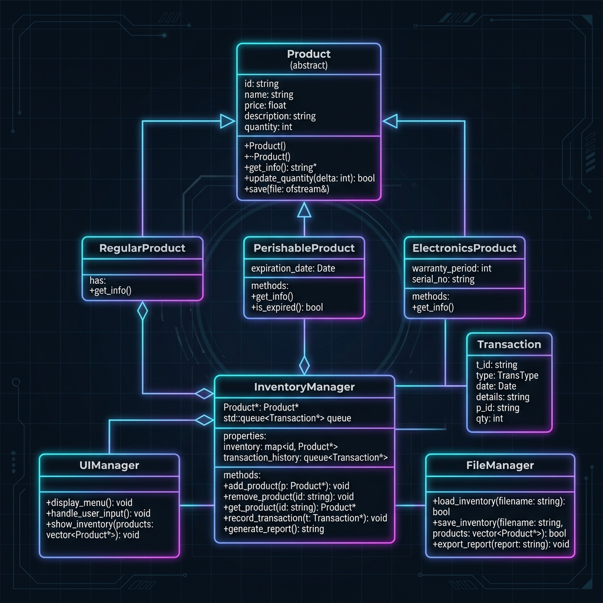
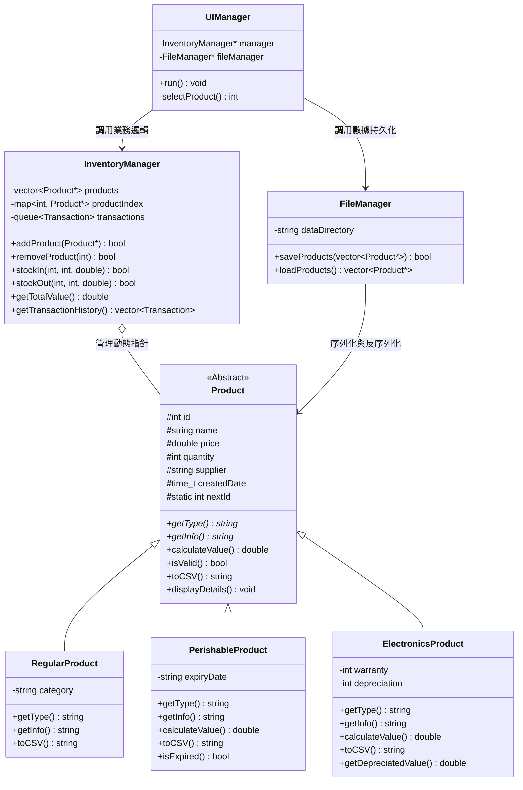

# 庫存管理系統 (Inventory Management System) - 架構設計說明書

本說明書詳述本系統的軟體架構、類別關係設計、C++ 物件導向特性（OOP）的應用、標準模板庫（STL）的容器選型理由，以及系統內存管理與數據流設計。

---

## 1. 系統架構與模組設計

本系統遵循**高內聚、低耦合**的模組化設計原則，將整體架構劃分為三個核心層次：
1. **資料模型層 (Data Model Layer)**：定義核心實體（商品及其子類別、交易紀錄）。
2. **業務邏輯層 (Business Logic Layer)**：負責在庫存內存中執行商品增刪改查、進出貨運算與多型價值評估。
3. **系統支撐層 (System Support Layer)**：處理終端機 UI 渲染、使用者互動輸入、檔案 I/O 讀寫與資料庫模擬。

### 1.1 系統架構關聯圖



以下為系統模組關係的 Mermaid 示意圖：



---

## 2. 物件導向設計 (OOP) 特性實踐

本系統核心代碼深度整合了 C++ 的物件導向三大特性：封裝、繼承與多型。

### 2.1 封裝 (Encapsulation)
* 所有的商品類別將成員變數設為 `protected`（如 `Product`）或 `private`（如子類別特有屬性），僅透過 `public` 的 Getter 與 Setter 函數對外提供存取介面，確保內部狀態不被外部非法修改（例如限制數量不可直接指派，必須透過 `addStock()` 或 `removeStock()` 進行邏輯過濾）。
* `InventoryManager` 封裝了內存資料結構（Vector、Map、Queue），UI 層無法直接操作這些容器，必須透過 `addProduct`、`stockIn` 等封裝好的業務介面進行安全操作。

### 2.2 繼承 (Inheritance)
* 以 `Product` 作為基底類別，抽象化了所有商品共有的核心屬性（ID、品名、價格、庫存量、供應商）與行為。
* `RegularProduct`、`PerishableProduct` 與 `ElectronicsProduct` 透過 `public` 繼承，無償繼承了基底類別的所有基礎邏輯，並各自擴展特有成員（如 `expiryDate`、`warranty`），極大地提高了代碼的複用性（DRY 原則）。

### 2.3 多型與動態綁定 (Polymorphism & Dynamic Binding)
多型是本系統設計的精髓，主要體現在以下幾個關鍵點：

1. **虛擬解構子 (Virtual Destructor)**：
   * 基底類別宣告 `virtual ~Product() = default;`。這是記憶體安全的關鍵。當 `InventoryManager` 透過 `Product*` 指針來釋放子類別對象（如 `delete productPtr`）時，C++ 運行時系統會進行動態綁定，正確調用衍生類別的解構子，確保子類別特有成員（如 `std::string` 類型）的記憶體被完整釋放，杜絕記憶體殘留。
2. **純虛擬函數 (Pure Virtual Functions)**：
   * `virtual string getType() const = 0;` 與 `virtual string getInfo() const = 0;` 將 `Product` 定義為**抽象類別 (Abstract Class)**，強制所有子類別必須實作這兩個接口，從語法層面規範了商品的行為特徵。
3. **多型價值評估 (`calculateValue`)**：
   * 在統計報表時，`InventoryManager` 遍歷 `vector<Product*>`，直接對每個指針調用 `product->calculateValue()`。
   * 運行時會根據對象的實際動態類型：
     * 普通商品：執行 `price * quantity`。
     * 易腐商品：執行過期檢測，若過期則返回 `0.0`，否則返回 `price * quantity`。
     * 電子產品：執行折舊算法，返回 `(price * 0.9^warranty) * quantity`。
   * 這使得統計模組完全不需要使用繁瑣的 `if-else` 或 `switch` 去判斷商品類型，展現了極高擴充性的開閉原則（OCP）。

---

## 3. STL 標準模板庫選型與應用

系統內部的資料管理與算法操作大量依賴 C++ 標準模板庫（STL），各容器與算法的選型理由如下：

### 3.1 容器選型 (Containers Selection)

| 實體 / 用途 | STL 容器 | 選型理由與時間複雜度分析 |
| :--- | :--- | :--- |
| **商品總清單儲存** | `std::vector<Product*>` | 1. 需要頻繁進行順序遍歷與報表輸出。<br>2. Vector 提供連續記憶體空間，遍歷效率極高。<br>3. 支援尾部隨機插入，操作複雜度為 $O(1)$。 |
| **快速商品檢索** | `std::map<int, Product*>` | 1. 系統需要頻繁根據「商品 ID」查詢、修改商品。<br>2. 若只用 Vector 遍歷，每次查詢複雜度為 $O(N)$。<br>3. Map 底層為紅黑樹（自平衡二元搜尋樹），將 ID 與指針關聯，使查詢與刪除時間複雜度穩定控制在 $O(\log N)$。 |
| **交易歷史流水** | `std::queue<Transaction>` | 1. 交易紀錄具有強烈的時間順序性與「先進先出 (FIFO)」特徵。<br>2. 採用 Queue 能自然模擬交易流水的堆疊與讀取，符合業務邏輯。 |

### 3.2 演算法應用 (Algorithms)
* **排序 (`std::sort`)**：在價值報表中，使用 `std::sort` 配合自訂的 Lambda 表達式，依據多型價值 `calculateValue()` 對商品指針進行降冪排序，演算法時間複雜度為 $O(N \log N)$：
  ```cpp
  sort(products.begin(), products.end(),
       [](Product* a, Product* b) { return a->calculateValue() > b->calculateValue(); });
  ```
* **條件篩選 (`std::copy_if`)**：在搜尋與庫存警告中，利用 `std::copy_if` 篩選出符合特定條件（如名稱包含關鍵字、庫存 $\le 10$）的商品集合，代碼簡潔且高效。

---

## 4. 記憶體管理與安全防禦策略

在 C++ 中，動態記憶體管理是程式穩定性的基石。本系統實施了以下安全策略：

### 4.1 指針所有權 (Pointer Ownership)
* **統一所有權**：系統規定，所有動態分配（`new`）的商品對象指針，其**唯一所有權**歸屬於 `InventoryManager`。
* **生命週期維護**：
  * 當商品被成功加入 `InventoryManager`（透過 `addProduct`），Manager 負責將其儲存於 `products` 向量與 `productIndex` 映射中。
  * 當商品被刪除（`removeProduct`）或系統關閉（調用析構子 `~InventoryManager`）時，Manager 負責執行 `delete` 釋放動態指針，保證每一塊動態記憶體都有對應的 `delete`。

### 4.2 記憶體安全防禦 (Memory Safety Defenses)
* **防範加載洩漏**：在 `UIManager::loadData()` 中，若從 CSV 加載商品後，`manager->addProduct(product)` 執行失敗（例如 ID 已存在），系統會立刻執行 `delete product;`，防止加載失敗的懸空指針造成記憶體洩漏。
* **空指針防禦 (Nullpointer Check)**：在所有業務操作（如進出貨、修改、展示細節）中，均會優先檢測指針是否為空（`if (!product) return false;`），從根本上杜絕了「解引用空指針 (Null Pointer Dereference)」導致的程式崩潰。
* **解構與清空同步**：在清除資料或 Manager 析構時，執行 `delete` 後必定伴隨 `clear()` 操作，將 Vector 與 Map 內儲存的無效指針清除，防止產生「懸空指針 (Dangling Pointer)」。
